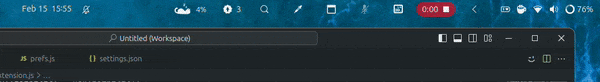

        

# HideItems
This is a GNOME extension from GNOME 45.

The idea is came from MacOS, [Hidden](https://github.com/dwarvesf/hidden) extension.
This extension provide help for a clean interface on the top bar.

#Install

  ## 1. method
  Install from gnome extension website: [GNOME extensions](https://extensions.gnome.org/extension/6771/hide-items/)  
  ## 2. method
  1. Download from source

    https://github.com/fablevi/HideItems/archive/refs/heads/main.zip

  2. Extract it
  3. Rename the file to:

    HideItems@fablevi.github.io

  4.Copy it to the right folder

    $ cp -r  Downloads/HideItems@fablevi.github.io .local/share/gnome-shell/extensions/

  5.Log out or reboot the system

    $ reboot
     
I tested on GNOME 45/ Ubuntu 23.10
Probably it will work on every icon on the _rightBox item. I still not figure out what happens if some icon is appear on the right side of my extensions icon, but im working on it 🙂.
